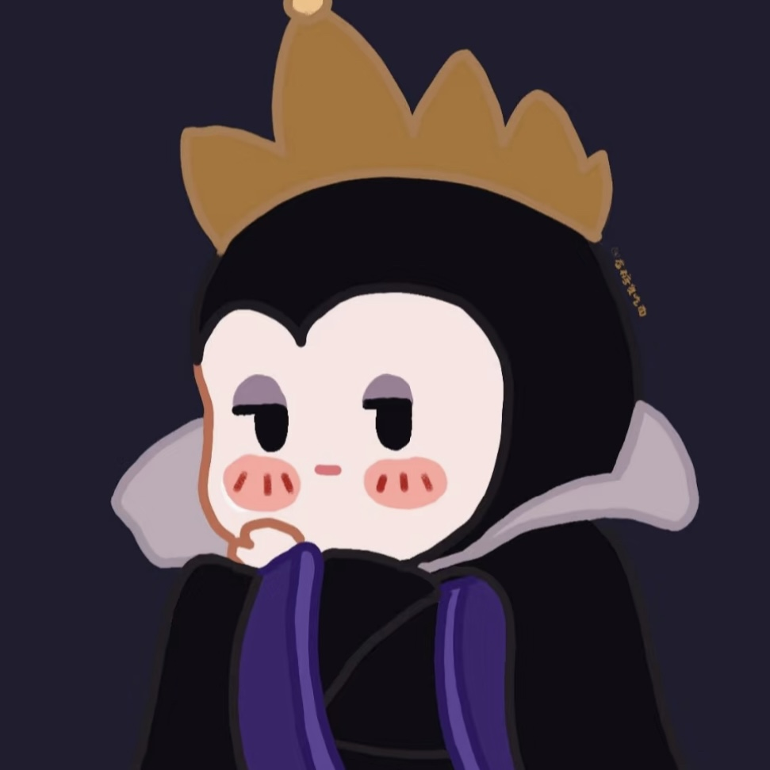

```{css, echo = FALSE}
img.portrait{
  width:60%;
  float:bottom;
  float:right;
}
```
\
Welcome to our project! Meet the team behind the scenes, dedicated to making this project a success. Our team has **four princesses** and one "**evil stepmother**", who’s always trying to turn us into soup!

```{=html}
<table style="width:90%">
  <tr>
    <td><h3>Jianming Wang</h3></td>
    <td></td>
  </tr>
  <tr>
    <td>  Jianming graduated from Fudan University, majoring in biological sciences. He began to study in Mailman School of Public Health, Columbia University in 2024 and is expected to graduate in 2026, majoring in Biostatistics. Now he is interested in biostatistical methodology topics. Out of academic, he enjoys painting, cooking and playing computer games.<a href="https://jianming-jmm.github.io/jw4693.github.io/"> Know More about Him!</a></td>
    <td></td>

    
  </tr>
  <tr>
    <td><h3>Linshan Xie</h3></td>
    <td></td>
  </tr>
  <tr>
    <td>  Linshan Xie is currently a first-year Master of Science student in Biostatistics at Columbia University. She earned her Bachelor of Science in Life Sciences from Fudan University. Outside of her academic pursuits, Linshan enjoys singing, watching variety shows, and gathering with friends for board games and mystery role-playing games, where she’s always up for a challenge and a good laugh!<a href="https://1inshan3xie.github.io/p8105_hw4_lx2346/"> Know More about Her!</a></td>
    <td></td>
  </tr>
  
  <tr>
    <td><h3>Vivian Xia</h3></td>
    <td></td>
  </tr>
  <tr>
    <td>  Vivian Xia graduated from University of Liverpool, majoring in Applied Mathematics. She began to study in Mailman School of Public Health, Columbia University in 2024 and is expected to graduate in 2025, majoring in Environmental Health Data Science. Now she is interested in combining mathematical problem-solving methods with theories in Environmental Health together to trackle more realistic problems. Out of academic, she enjoys painting, cooking，shopping and Latin dancing.<a href="https://VivianX0724.github.io/YX2953.github.io"> Know More about Her!</a></td>
    <td></td>
  </tr>
  
  <tr>
    <td><h3>Yunjia Liu</h3></td>
    <td></td>
  </tr>
  <tr>
    <td>  Yunjia (Veronica) Liu is currently pursuing a Master of Science in Biostatistics at Columbia University, with a focus on statistical genomics. She earned her Bachelor of Science in Biology from Fudan University, where she developed a strong foundation in genetics, bioinformatics, and computational biology.<a href="https://veronical273.github.io/yunjialiu.github.io/"> Know More about Her!</a></td>
    <td></td>
  </tr>
  
  <tr>
    <td><h3>Tingyu Qian</h3></td>
    <td></td>
  </tr>
  <tr>
    <td> Tingyu Qian graduated from Pennsylvania State University with a major in Actuarial Statistics and a minor in Mathematics. She is currently pursuing a Master of Science in Biostatistics at Columbia University, specializing in public health data science. Outside of academics, she enjoys playing video games and spending time with friends.<a href="https://tingyusally.github.io/"> Know More about Her!</a></td>
    <td></td>
  </tr>
</table>
```

